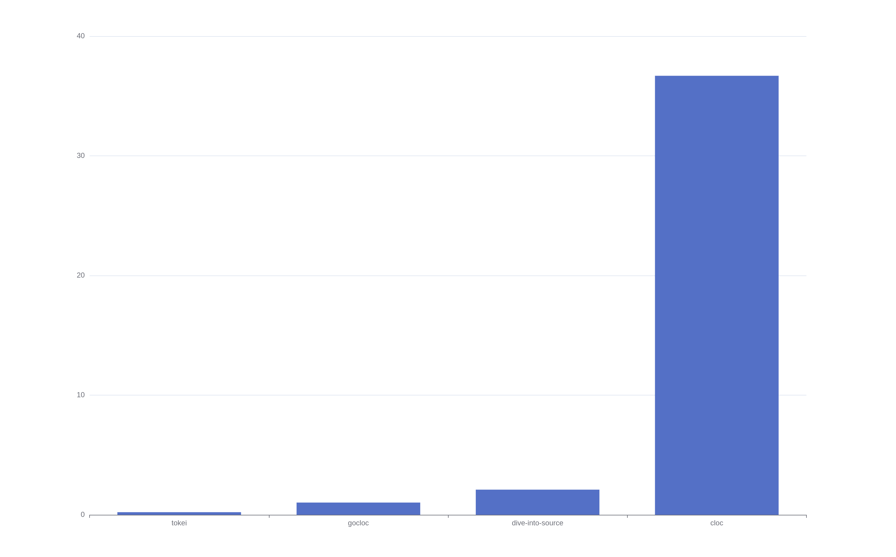

# Dive Into Source

A stupid simple, powerful source code analyzer, targeting help you understand repo source code as quickly as possible.

Most important, it's beautiful.

## Features

### Basic

1. Count lines of code, total files, and ranking of folders based on including lines of code.

See [Benchmark](#benchmark) for the performance compared to other similar tools.


### Advanced

1. Generate calling-link between all functions or methods
2. Generate data objects


### Ultimate

1. Parse repo git data.
2. Full-text fuzzy search in code.


## Why the project?

Motivated by [cloc](https://github.com/AlDanial/cloc), a tool to count lines of code of a repo.

Being a software or hardware engineer, most of our carrer time will spend on reading source code of others, maby be 80 percent or 90 percent.

When i view linux kernel source code, it's too hard to understand kernel which has more than 18 million lines of code.

So i searched with google, willing to find a better tool to help me. sadly, existing tools either bad or just expensive,

Besides, all of them have bad UI and being very complex, that's why dive-into-source came out!

## How i built it?

## Design Features

1. Fully extensible. you can write your own language to be accepted by dive-into-source. Besides, you can even write your own analyze feature.


## Getting Started

### Concepts:

1. dive-into-source: All in one library to start with the project
2. dive-into-source-engine: The engine library to analyze source code
3. dive-into-source-visual: The default visual website to render generated data by engine


### How to install?


### Usage


## Roadmap


## Benchmark

Cloc feature benchmark:

#### env:

* Intel® Core™ i5-11600K / 16G Mem / Ubuntu 21.04
* tokei: version 12.1.2, written in Rust.
* cloc: version 1.86, written in Perl.
* gocloc: version v0.4.1, written in Go.
* dive-into-source: version 0.1.4, written in Node.js.
* **Target codebase: [kubernetes/kubernetes, commit: 08bf54678e2](https://github.com/kubernetes/kubernetes/commit/08bf54678e2bef8b4c72c8c6d104b0bdf19a6f75), which has 104458 commits and 23398 files.**

### tokei

```bash
$ time tokei --sort code .

===============================================================================
Language            Files        Lines         Code     Comments       Blanks
===============================================================================
Go                  15172      5098497      3706070       935213       457214
JSON                  529       760243       760239            0            4
YAML                 3708       203267       201191         1319          757
Shell                 341        49753        31179        12336         6238
Protocol Buffers      117        34374        11772        17177         5425
GNU Style Assembly    109        15030        10618         1821         2591
PowerShell              7         4157         3034          802          321
Makefile               65         3512         1989          977          546
Autoconf               22          914          870           40            4
C Header                1         5605          839         4378          388
BASH                   14          942          763           88           91
Dockerfile             58         1570          490          837          243
Lua                     1          509          453           31           25
Python                  7          690          437          137          116
SVG                     4          386          378            4            4
C                       7          284          156           88           40
TOML                    5          184           74           86           24
INI                     1           12           10            0            2
HTML                    4            4            4            0            0
Batch                   1           21            2           17            2
Plain Text             38         7473            0         7204          269
-------------------------------------------------------------------------------
Markdown              505        81908            0        63250        18658
|- BASH                35          283          237           27           19
|- C                    1           33           19           13            1
|- Go                 104         4538         3604          386          548
|- Java                 1            7            7            0            0
|- JSON                 4           55           51            0            4
|- PowerShell           1           10            9            1            0
|- Shell                8          234          182           18           34
|- YAML                10           94           91            2            1
(Total)                          87162         4200        63697        19265
===============================================================================
Total               20716      6269335      4730568      1045805       492962
===============================================================================
tokei --sort code .  1.44s user 0.33s system 808% cpu 0.219 total
```

### cloc

```bash
$ time cloc .

22735 text files.
19130 unique files.
5142 files ignored.

6 errors:
Line count, exceeded timeout:  ./plugin/pkg/auth/authorizer/rbac/bootstrappolicy/policy.go
Line count, exceeded timeout:  ./vendor/golang.org/x/net/idna/tables10.0.0.go
Line count, exceeded timeout:  ./vendor/golang.org/x/net/idna/tables11.0.0.go
Line count, exceeded timeout:  ./vendor/golang.org/x/net/idna/tables12.0.0.go
Line count, exceeded timeout:  ./vendor/golang.org/x/net/idna/tables13.0.0.go
Line count, exceeded timeout:  ./vendor/golang.org/x/net/idna/tables9.0.0.go

github.com/AlDanial/cloc v 1.86  T=36.55 s (482.8 files/s, 169537.7 lines/s)
  --------------------------------------------------------------------------------
  Language                      files          blank        comment           code
  --------------------------------------------------------------------------------
  Go                            14820         489111         917920        3672116
  JSON                            363              4              0         740686
  YAML                           1266           1184           1437         143997
  Markdown                        464          19199              0          67689
  Bourne Shell                    336           6289          12327          30904
  PO File                          12           1873          13413          11291
  Protocol Buffers                115           5409          18018          10827
  Assembly                         99           2583           2634           9795
  PowerShell                        7            418           1058           2681
  make                             64            545            951           1985
  C/C++ Header                      1            399           4367            839
  Bourne Again Shell               12             89             74            773
  Dockerfile                       52            237            753            478
  Lua                               1             30             26            453
  sed                               4              4             32            438
  Python                            7            119            159            412
  SVG                               4              4              4            378
  C                                 7             49             79            156
  Bazel                             4             10              0            120
  TOML                              5             24             86             74
  INI                               1              2              0             10
  HTML                              3              0              0              3
  DOS Batch                         1              2             17              2
  --------------------------------------------------------------------------------
  SUM:                          17648         527584         973355        4696107
  --------------------------------------------------------------------------------
  cloc .  36.29s user 0.31s system 99% cpu 36.690 total
```

### gocloc

```bash
$ time gocloc .

-------------------------------------------------------------------------------
Language                     files          blank        comment           code
-------------------------------------------------------------------------------
Go                           14820         489111         930884        3659152
JSON                           361              4              0         740668
YAML                          1260           1153           1431         143787
Markdown                       458          19161              0          67584
BASH                           337           6215          12255          30972
Protocol Buffers               115           5409          17129          11716
Assembly                        99           2586           2634           9792
Plain Text                      26            189              0           6848
Makefile                        62            530            951           1929
C Header                         1            399           4367            839
Bourne Shell                    11            163            146            705
Lua                              1             30             26            453
sed                              4              4             32            438
Python                           7            119            159            412
PowerShell                       3             45             83            190
C                                7             49             79            156
TOML                             5             24             86             74
HTML                             3              0              0              3
Batch                            1              2             17              2
-------------------------------------------------------------------------------
TOTAL                        17581         525193         970279        4675720
-------------------------------------------------------------------------------
gocloc .  1.34s user 0.24s system 154% cpu 1.023 total
```

### dive-into-source

```bash
$ time divesource .

The .gitignore file: ./Kubernetes/.gitignore found.
All files and dirs listed in .gitignore file will be ignored.
Total 23364 files found, start analyzing...
ClocFeature -----------------

--------------------------------------------------------------------------------
Language                      files          blank        comment           code
--------------------------------------------------------------------------------
Go                           15,172        474,909        933,215      3,705,540
JSON                            529             53              0        760,239
YAML                          3,802          4,950          1,474        202,694
Markdown                        536         19,518              0         68,315
Shell                           339          6,602         12,692         30,439
C/C++ Header                      1            372          4,378            856
Python                            7            123            169            405
C                                 7             47             88            156
HTML                              4              4              0              4
--------------------------------------------------------------------------------
Total                        20,397        506,578        952,016      4,768,648
--------------------------------------------------------------------------------

----------------------------------
-------- Summary ----------------
Total files: 23364
Ignored files: 2967
Time consumed: 2.052s
---------------------------------
divesource .  2.96s user 0.52s system 165% cpu 2.102 total
```

### Benchmark summary



Smaller is better.
